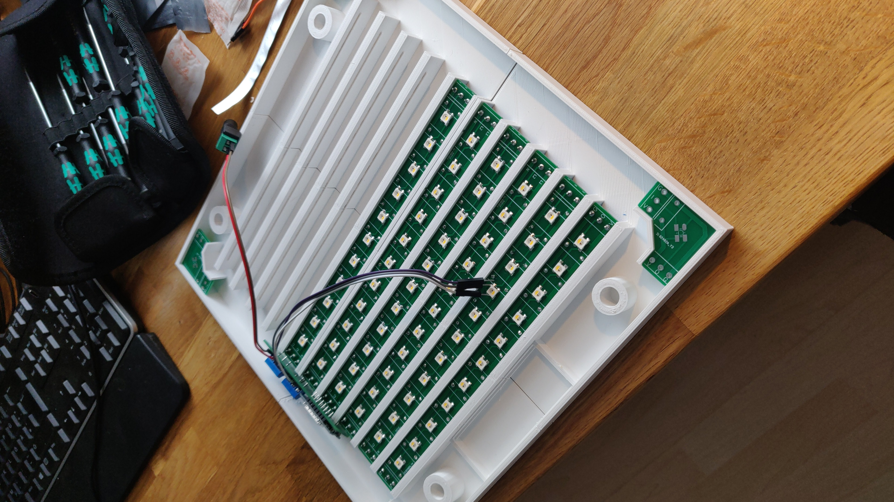
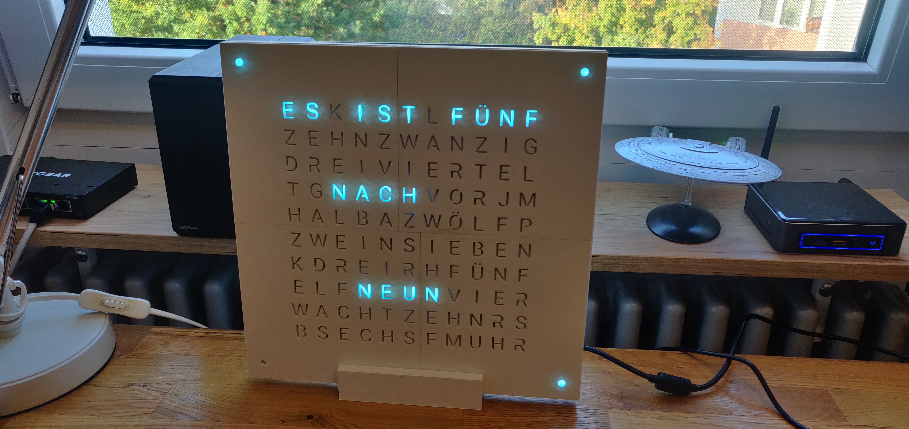

<h1 align="center">
    QLock Table
</h1>

<h4>
    Small word clock with stand powered by esp8266 with mqtt support
</h4>

  

  

  

## Android Watch Face and Widget

The word clock is now available as a Wear OS Watch Face and as an Android widget. Check out the links above.

## Description

This repository contains all .stl, gerber and .ino files to build the qlock-table by yourself. The stl files can be directly imported into your favorite slicer software (e.g. cura, prusaslicer, ...). The gerber files can be uploaded to [jlcpcb](https://jlcpcb.com/) or a different pcb manufacturing service. The ino files can be compiled and uploaded via the arduino cli or ide.

## Highlights

- Matrix transition
- MQTT support

## Contents

- [Description](#description)
- [Highlights](#highlights)
- [Bill of Material](#bill-of-material)
- [Usage](#usage)
- [Images](#images)
- [Team](#team)
- [License](#license)

## Bill of Material

- 114 Nano Pixel Leds, [website](https://www.adafruit.com/product/3484)
- wemos d1 mini, [website](https://www.wemos.cc/en/latest/d1/d1_mini.html)
- 114 100NF Capacitors, [website](https://www.conrad.de/de/p/tru-components-tc-k100nf5-keramik-kondensator-tht-100-nf-50-v-20-1-st-1589524.html)
- 10 Row pcb's
- 4 Corner pcb's
- 1 Main pcb

### Optional

- 30 screw terminal block, [website](https://www.conrad.de/de/p/degson-dg301-5-0-03p-12-schraubklemmblock-1-50-mm-polzahl-num-3-blau-1-st-730196.html)

## Usage

### MQTT

To change the color of the word clock connect to your broker and send the following command: `cmnd/qlock-table/color` and the following payload (rgbw) `255000255000`.

## Images

  

  

## Team

- Thomas Pöhlmann [(@perryrh0dan)](https://github.com/perryrh0dan)

## License

[MIT](https://github.com/perryrh0dan/passline/blob/master/license.md)

This repository was generated by [tmpo](https://github.com/perryrh0dan/tmpo)
